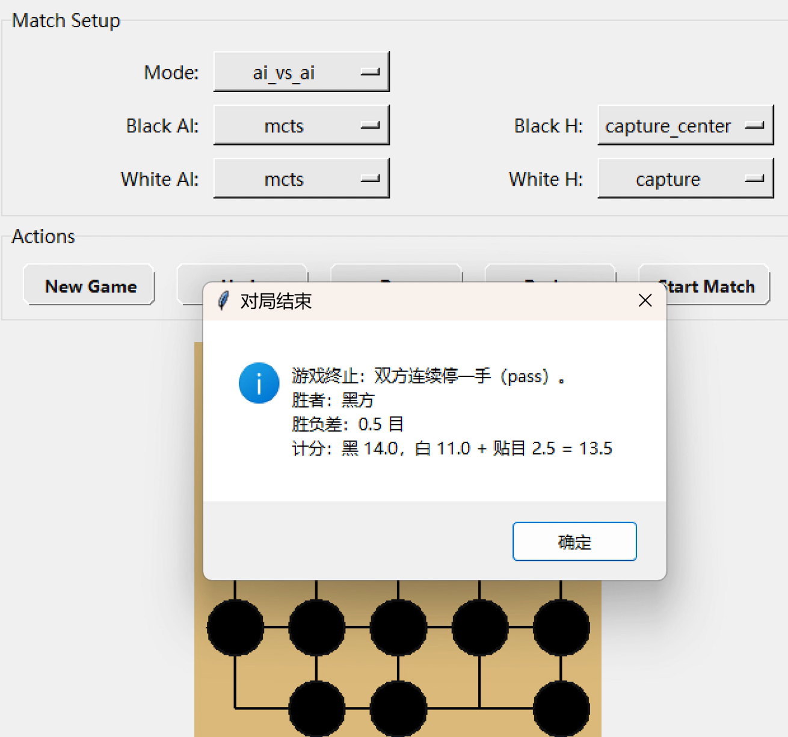
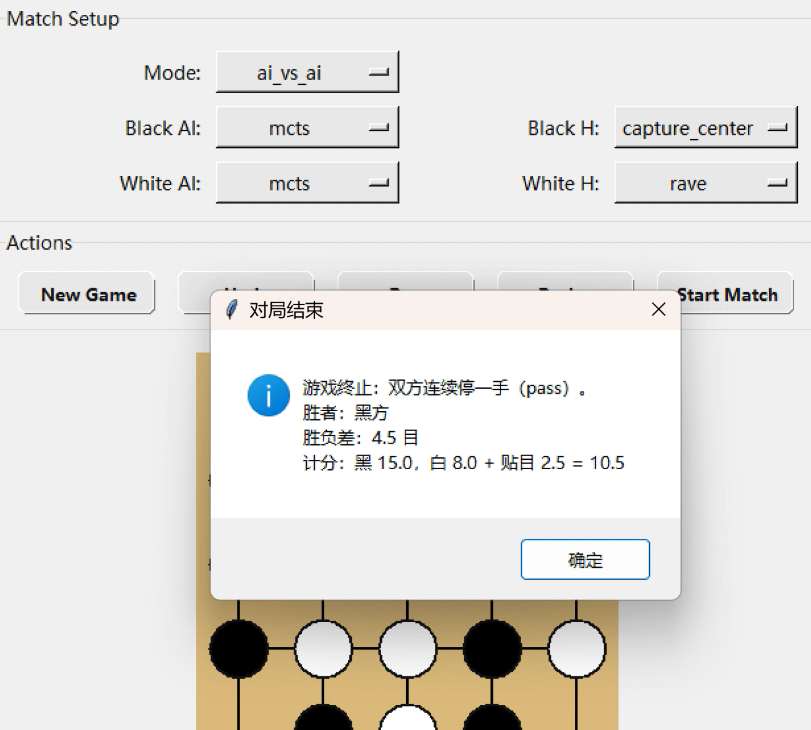
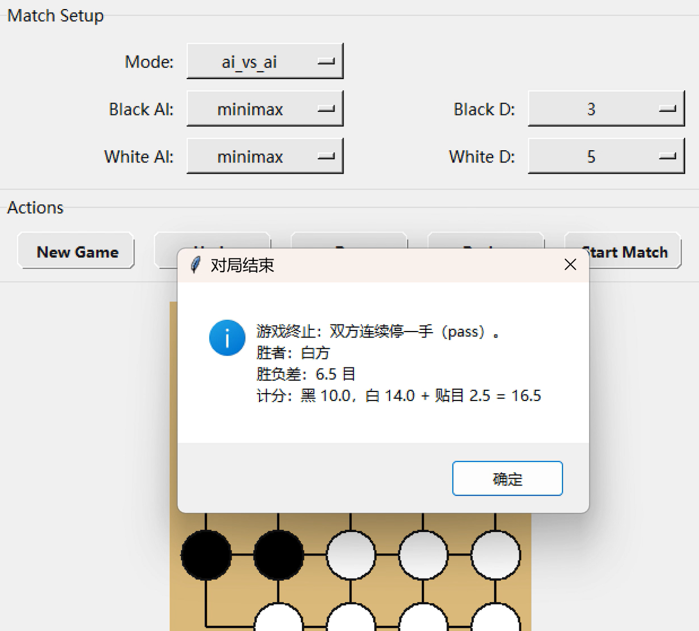

# 围棋 AI 大作业报告

## 一、项目概述

本题目实现了一个 5x5 围棋对弈系统，包含随机 AI、MCTS AI、Minimax AI（选做）以及图形化界面。项目基于课程提供的 `dlgo` 规则框架完成，棋盘合法性、提子、禁入点、终局判断、计分等基础规则均由底层模块支持，智能体只需要关注决策逻辑与对弈体验即可。

项目目标：

1. 实现一个可运行、可验证的围棋 AI 系统。
2. 在 MCTS 中加入至少两种加速/增强策略，提高搜索效率。
3. 设计一个便于人机对弈的界面，支持模式切换、悔棋、开始比赛与状态显示。

---

## 二、整体设计

项目主要由四部分组成：

1. `agents/random_agent.py`：随机 AI，用于验证规则框架与基础合法走子逻辑。
2. `agents/mcts_agent.py`：核心实现，完成 MCTS 搜索，并加入启发式 rollout、深度限制、RAVE 等优化。
3. `agents/minimax_agent.py`：选做实现，使用 Minimax + Alpha-Beta 剪枝 + 置换表缓存。
4. `gui_play.py`：Tkinter 图形界面，负责棋盘绘制、按钮交互、状态展示以及人机/机机对战流程控制。

整体流程为：界面根据当前模式选择对应智能体，智能体读取 `GameState` 并生成合法棋步返回界面；界面将棋步应用到新局面，并同步更新提子数、回合数与终局提示。

---

## 三、随机 AI 实现

随机 AI 的主要作用不是追求对弈强度，而是验证规则模块是否能够正确工作。实现上，`RandomAgent.select_move()` 直接调用 `game_state.legal_moves()` 获取全部合法棋步，再从中随机选择。

结合界面交互与作业使用场景，本项目对随机 AI 额外做了约束处理：不主动选择认输。这样可以避免智能体在对局过程中因 `resign` 而提前结束，也符合“不要认输”的使用需求。若没有其它可选走法，则返回 `pass`。

该部分实现虽然简单，但具有基础性作用，因为后续 MCTS 和 Minimax 的搜索分支都建立在同一套合法走子接口之上。

---

## 四、MCTS AI 设计与实现

MCTS 是本项目的核心。标准 MCTS 包含四个阶段：Selection、Expansion、Simulation、Backup。代码中对应为：

```
输入：当前局面 state，模拟轮数 num_rounds，时间上限 time_limit
输出：最终落子 move

1. root ← 以 state 创建根节点
2. 在未达到轮数上限且未超时的前提下循环：
 2.1 从 root 出发，按 UCT 规则选择到叶节点
 2.2 若当前节点存在未展开棋步，则扩展一个子节点
 2.3 从该节点进行 rollout，直到终局或达到深度限制
 2.4 将模拟结果沿路径反向传播
3. 从根节点子节点中选择访问次数最多的棋步作为输出
```

1. `MCTSNode.best_child()`：使用 UCT 公式选择子节点。
2. `MCTSNode.expand()`：从未尝试棋步中扩展一个新节点。
3. `MCTSNode.backup()`：把模拟结果沿路径反向传播到根节点。
4. `MCTSAgent.select_move()`：主循环，负责迭代模拟与最终落子选择。
5. `MCTSAgent._simulate()`：快速模拟并引入启发式与深度限制。

### 4.1 Selection

Selection 使用 UCT 作为节点选择标准，兼顾“已知高价值”与“未充分探索”。实现上采用：

$$
UCT = \text{exploitation} + c \cdot \sqrt{\frac{\ln(N)}{n}}
$$

其中 `exploitation` 由子节点平均胜率估计，`exploration` 对访问少的节点给予更高奖励。这样可以在搜索早期覆盖更多分支，在后期逐渐偏向高质量走法。

### 4.2 Expansion

节点展开时，先从合法走法中剔除 `resign`，避免搜索树中出现无意义的提前认输分支。每次只扩展一个子节点，控制树宽增长速度，减少计算开销。

### 4.3 Simulation

模拟阶段是本项目进行优化最多的部分。标准 MCTS 的随机 rollout 在围棋中噪声很大，因此实现中使用了多种策略：

1. **启发式走子策略**：优先选择提子、靠近中心或综合提子与中心偏好的落点，而不是纯随机。
2. **限制模拟深度**：`max_rollout_steps` 限制 rollout 最多走若干步，防止单次模拟过长。
3. **RAVE/AMAF 思路**：在 rollout 中记录某一方实际走过的点，并把这些统计用于后续 rollout 的走法偏好判断。

其中，`capture_center` 是默认启发式，综合了提子倾向和中心优先；`rave` 则会根据历史 rollout 的 AMAF 统计对落点进行排序。这样可以减少完全随机带来的高方差，提高早期搜索效率。

### 4.4 Backup

模拟结束后，结果沿路径向上回传。每个节点维护访问次数与累计胜率，父子层之间采用对手视角的价值互补更新，从而保证统计与当前轮到谁走相匹配。

### 4.5 搜索流程

`MCTSAgent.select_move()` 会在时间限制或轮数限制内不断执行上述四步，并在最后根据根节点子节点的访问次数与价值选出最终棋步。为适应交互式界面，本项目还设置了时间上限，保证每步落子不会过久阻塞界面。

---

## 五、Minimax AI 设计与实现

Minimax 是选做部分，主要用于和 MCTS 做对比。实现中包含：

```
输入：当前局面 state，搜索深度 depth
输出：最优棋步 move

1. 对 state 的每个合法棋步进行枚举
2. 对每个棋步递归计算下一层的极大极小值
3. 在递归过程中结合 Alpha-Beta 剪枝提前终止无效分支
4. 使用局面评估函数对叶节点或终局节点打分
5. 返回评估值最高的棋步作为输出
```

1. `minimax()`：基础极小化极大递归。
2. `alphabeta()`：Alpha-Beta 剪枝优化。
3. `_default_evaluator()`：默认局面评估函数。
4. `GameResultCache`：置换表缓存，减少重复局面计算。

### 5.1 评估函数

由于围棋局面复杂，单纯依赖终局胜负会导致搜索太慢，因此评估函数采用了轻量启发式：

1. 子数差。
2. 气数差。
3. 终局时使用真实计分结果作为强信号。

该设计虽然不能达到专业围棋引擎的水平，但足以在 5x5 棋盘上提供一个可对比的搜索基线。

### 5.2 Alpha-Beta 与缓存

Alpha-Beta 剪枝能够在不影响结果正确性的前提下减少无效分支搜索。为了进一步减少重复计算，项目中还加入了基于 Zobrist 哈希的缓存结构，用于记录已评估局面的结果与深度信息。这样在搜索树出现重复状态时，可以直接复用已有估值。

---

## 六、图形化界面设计

界面使用 Tkinter 实现，主要功能包括：

1. 固定窗口大小，避免界面跳动。
2. 支持 `human_vs_ai` 与 `ai_vs_ai` 两种模式。
3. 动态隐藏不需要的选项，减少用户操作负担。
4. 提供 `New Game`、`Undo`、`Pass`、`Resign`、`Start Match` 等控制按钮。
5. 在底部状态栏显示回合数、模式、提子数、当前轮次以及 AI 思考状态。

界面中还特别处理了几个交互细节：

1. `human_vs_ai` 时只显示当前人类颜色对应的设置，另一侧 AI 选项隐藏。
2. `ai_vs_ai` 时隐藏人类颜色选择，避免用户看到无关选项。
3. 悔棋时回退一个完整回合，也就是黑白各撤销一步，符合对局习惯。

---

## 七、实验结果分析

本节阐述三类核心对比：MCTS 不同启发函数、Minimax 不同搜索深度、MCTS 与 Minimax 整体差异。

### 7.1 MCTS 不同启发函数对比

本项目在 `mcts_agent.py` 中实现了多种 rollout 启发函数，包括 `capture_center`、`capture`、`center` 和 `rave`。其中，`capture_center` 用于综合考虑提子收益与落子位置，通常能在稳定性和攻击性之间取得较平衡的表现；`capture` 更偏向短期战术收益；`center` 更强调局面展开的均衡性；`rave` 则利用 rollout 过程中积累的 AMAF 统计经验进行引导，适合在早期搜索阶段提升样本利用率。

优劣势分析对比表如下。

| 启发函数 | 核心思路 | 优势 | 劣势 |
| --- | --- | --- | --- |
| `capture_center` | 优先提子并兼顾中心偏好 | 稳定性较好，攻守较均衡 | 对复杂局部战术区分能力有限 |
| `capture` | 强调即时提子收益 | 局部战术直接，短期收益明显 | 容易忽视全局布局 |
| `center` | 优先靠近棋盘中心 | 布局自然，开局形状较均衡 | 对直接战术机会不够敏感 |
| `rave` | 使用 AMAF 统计引导 rollout | 早期搜索利用率较高，收敛更快 | 统计偏差可能影响个别局面判断 |

- 不同启发函数下的 MCTS 对局截图:

<div style="display:flex; gap:12px; align-items:flex-start; flex-wrap:wrap;">
 
 
</div>

### 7.2 Minimax 不同搜索深度对比

Minimax 的搜索深度直接影响其决策质量与计算开销。浅层搜索响应较快，但更依赖局面评估函数；随着深度增加，搜索对局部战术的识别能力增强，但计算成本也会显著上升。结合本项目 5x5 棋盘规模，`max_depth=3/4/5/6` 提供了一个较为合适的对比范围。

优劣势分析对比表如下。

| 搜索深度 | 决策特征 | 优势 | 劣势 |
| --- | --- | --- | --- |
| `max_depth=3` | 搜索浅，响应快 | 运行开销低，交互流畅 | 战术前瞻性有限 |
| `max_depth=4` | 兼顾速度与搜索质量 | 稳定性提升，耗时可控 | 对复杂分支仍有遗漏 |
| `max_depth=5` | 搜索更深入 | 局部战术识别能力增强 | 计算成本明显上升 |
| `max_depth=6` | 深层搜索 | 决策更谨慎，压缩明显失误 | 响应时间较长，实时性下降 |

- Minimax 不同深度搜索对局截图：

<div style="display:flex; gap:12px; align-items:flex-start; flex-wrap:wrap;">
 
</div>

### 7.3 MCTS 与 Minimax 对比

MCTS 与 Minimax 的差异主要体现在决策机制上。MCTS 依赖大量采样与统计估计，更适合在有限时间内获得较稳健的局面判断；Minimax 则依赖显式递归搜索与评估函数，在小规模棋盘上具有较强的可解释性，但在分支因子较大的围棋问题中，搜索深度会受到明显限制。

优劣势分析对比表如下。

| 对比维度 | MCTS | Minimax |
| --- | --- | --- |
| 决策机制 | 采样统计驱动（Selection/Simulation） | 递归搜索驱动（Minimax/Alpha-Beta） |
| 核心优势 | 在高分支博弈中更灵活，有限时间内鲁棒性较好 | 逻辑清晰，可解释性强，搜索路径明确 |
| 核心劣势 | 依赖采样质量，结果存在随机波动 | 分支因子大时深度受限，耗时增长快 |
| 对评估函数依赖 | 相对较低（更多依赖 rollout 统计） | 相对较高（叶节点估值直接影响结果） |
| 参数敏感性 | 对 `num_rounds`、`rollout` 策略敏感 | 对 `max_depth`、评估函数敏感 |
| 工程适配性 | 更适合围棋类复杂搜索问题 | 更适合教学对比和小规模精确分析 |

- MCTS 的 capture_center 与搜索深度为 5 的 Minimax 对局截图:

<div style="display:flex; gap:12px; align-items:flex-start; flex-wrap:wrap;">
 
</div>

### 7.4 小结

综合三组对比可见：MCTS 在围棋这种高分支决策问题上更具实用性，尤其是配合启发式 rollout 与 RAVE 时，能够在有限计算预算下获得更稳定的落子效果；Minimax 的价值在于搜索逻辑清晰、可解释性强，适合用于算法机制分析与课程对比实验。

---

## 八、与 AlphaGo / AlphaZero 的对比

本项目与 AlphaGo、AlphaZero 的核心差异主要体现在以下三个方面：

1. **没有深度神经网络**：本项目的策略与价值判断主要依赖启发式和统计搜索；AlphaGo/AlphaZero 则使用网络给出先验概率和局面价值。
2. **搜索规模远小**：本项目使用的是适合课程作业的轻量级 MCTS；真实系统会做更深的搜索和更复杂的并行优化。
3. **训练方式不同**：AlphaZero 通过自我博弈持续训练网络，而本项目没有训练过程，更多依赖人工设计的规则和特征。

尽管如此，本项目体现了 AlphaGo 系列方法的核心思想：通过搜索和统计或启发式在有限算力下尽量做出更优决策。

---

## 九、总结

本项目完成了一个完整的 5x5 围棋 AI 对弈系统，实现了随机 AI、MCTS AI、Minimax AI 和图形化界面，并针对 MCTS 引入了启发式 rollout、深度限制和 RAVE 等优化。整体来看，系统能够稳定运行，支持人机对弈和机机对弈，也能够较好地展示不同搜索策略之间的差异。

本项目中使用的 AI 模型与工具为 **GitHub Copilot Chat（GPT-5.3-Codex）**：用于编码过程中的交互式辅助，包括代码重构、界面调整、文档整理与报告润色。

具体使用场景说明

1. **算法实现辅助**：用于快速整理 MCTS 与 Minimax 的代码框架和可选优化方向，降低从思路到可运行代码的转换成本。
2. **调试与重构辅助**：用于定位界面交互问题（如控件显示、悔棋逻辑、状态文本布局）并生成可迭代修改方案。
3. **文档辅助**：用于补充伪代码、实验分析结构和对比表格。

AI 工具显著提升了开发效率，尤其体现在快速搭建初版实现、多方案对比修改、文档结构化整理等方面。对于围棋 AI 这类同时包含算法与工程细节的任务，AI 能够降低重复编码成本，使我把更多精力放在策略设计、参数比较和结果分析上。

同时，我也体会到 AI 的输出需要严格人工把关，其建议通常能够提供可行方向，但在具体细节，例如界面交互预期、实验表述严谨性、局部逻辑边界，仍需结合项目目标进行二次判断。总体而言，AI 更适合提高效率、辅助思路，并非替代人工决策的最终方案。
